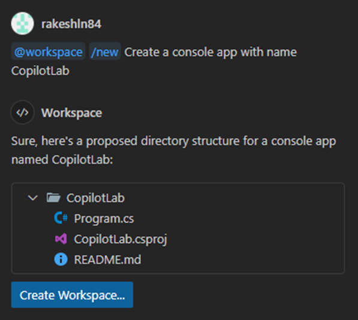

# Step 1: Getting Started with GitHub Copilot: Setting Up C# Console App

In this lab exercise, you will set up a new C# Console App using GitHub Copilot. This Console App will be enhanced in subsequent steps to build a Music Store application.

1. **Access GitHub Copilot:**

   - **Open the Chat Window:**

     - Click the chat icon in the activity bar or press `Control+Command+I` (Mac) / `Ctrl+Alt+I` (Windows/Linux).

   - **Start an Inline Chat:**

     - Use `Ctrl+I` (Windows) or `Cmd+I` (Mac) to start an inline chat directly in the editor.

   - **Quick Chat Dropdown:**

     - Open the quick chat dropdown by pressing `Shift+Command+I` (Mac) / `Shift+Ctrl+I` (Windows/Linux).

2. **Create a New C# Console App:**

   - Use Copilot chat to create a new C# Console App.
   - Type the following command to scaffold a new C# Console App:

     ```text

     /new Create a console app CopilotLab

     ```

   - Inspect the .csproj file in the suggection and make sure it is targeting net8.0. You can edit the text directly.

     ```
     <Project Sdk="Microsoft.NET.Sdk">
      <PropertyGroup>
        <OutputType>Exe</OutputType>
        <TargetFramework>net8.0</TargetFramework>
      </PropertyGroup>
     </Project>
     ```

   - Click on the `Create Workspace` button to set up the project.

   

3. **Run Your Application:**

   - From the terminal, navigate to the "CopilotLab" folder and run the following command:

     ```bash
     dotnet run
     ```

     You can also try asking Copilot for instructions on how to run the application.

[Previous - Home](./README.md) | [Next - Step 2: Building the Music Store Application](./02-Step02.md)
