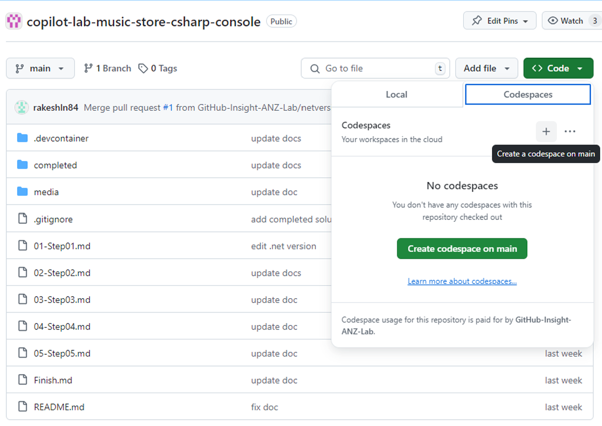

# Welcome to the GitHub Copilot Lab

## Introduction

This lab is designed to help you get started with GitHub Copilot by exploring its capabilities and features. You will build a simple .NET Core console application for a music store, using Copilot to generate code snippets, sample data, refactor code, write tests, and more.

The goal is to familiarize yourself with GitHub Copilot and understand how it can assist you in writing code more efficiently. Apply your learnings to real-world application development scenarios.

You can challenge yourself further by building more complex applications from other labs available in the GitHub Copilot Lab series.

## Lab Structure

The lab is divided into multiple steps, each focusing on a specific aspect of building the Music Store application using GitHub Copilot.

- **Step 1:** Getting Started with GitHub Copilot: Setting Up C# Console App
- **Step 2:** Building the Music Store Application
- **Step 3:** Refactoring and Enhancing Code Quality
- **Step 4:** Adding Unit Tests
- **Step 5:** Documenting the Codebase

Each step will guide you through the process of building the application using GitHub Copilot. You will be provided with instructions on how to interact with Copilot to generate code snippets, refactor code, write tests, and more.

Complete the [Lab Setup Instructions](#lab-setup-instructions) to get started with the lab.

Happy coding!

## Lab Setup Instructions

### Using Local Environment

**Prerequisites**

Before starting the lab, ensure you have the following installed on your machine:

- Visual Studio Code
- .NET 8 SDK
- GitHub Copilot extension

1. Fork this repository to your GitHub account.
2. Clone the repository to your local machine.
3. Open the repository in Visual Studio Code.
4. Install the GitHub Copilot extension from the Visual Studio Code marketplace and sign in to your GitHub account to activate the extension.

Note that you may be blocked from using the Copilot extension due to Firewall or VPN restrictions. If you encounter any issues, please contact your IT team to whitelist the GitHub Copilot extension. More information for troubleshooting common issues can be found [here](https://docs.github.com/en/copilot/troubleshooting-github-copilot/troubleshooting-common-issues-with-github-copilot).

### GitHub Codespaces

You can also use **Codespaces** to run the lab in the cloud:

1. Fork this repository to your GitHub account.
2. Click on the "Open in Codespaces" button at the top of the repository.
3. The Copilot extension is already installed in the Codespace. You may need to sign in to your GitHub account to activate the extension.

You can find more information on how to use Codespaces [here](https://docs.github.com/en/codespaces/getting-started/quickstart).

## Getting Stuck?

If you find yourself stuck at any point during the lab, remember to ask questions to GitHub Copilot in the chat. It's there to help you!

However, if you're really stuck, you can take a peek at the finished solution here: [https://github.com/GitHub-Insight-ANZ-Lab/copilot-lab-music-store-csharp-console/tree/main/completed](https://github.com/GitHub-Insight-ANZ-Lab/copilot-lab-music-store-csharp-console/tree/main/completed).

But remember, try to figure it out on your own first. The real learning happens when you're solving problems yourself!

---

[Next - Step 1: Getting Started with GitHub Copilot: Setting Up C# Console App](./01-Step01.md)
